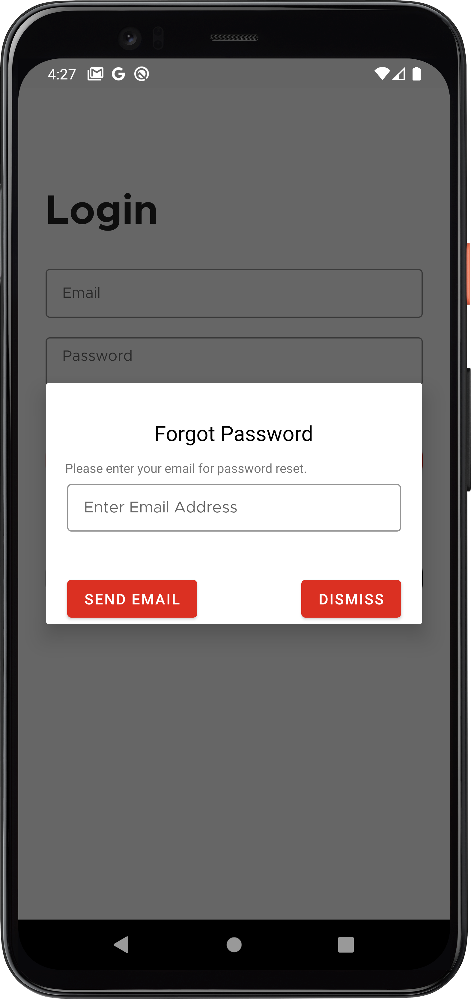
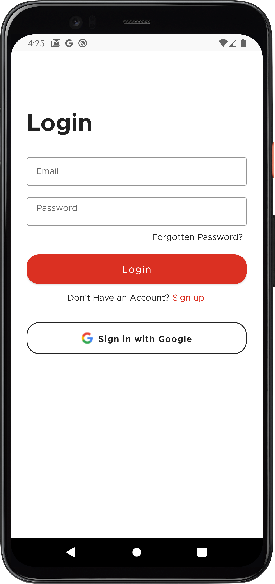
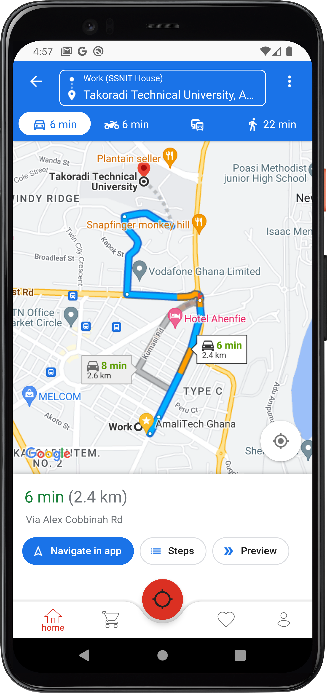
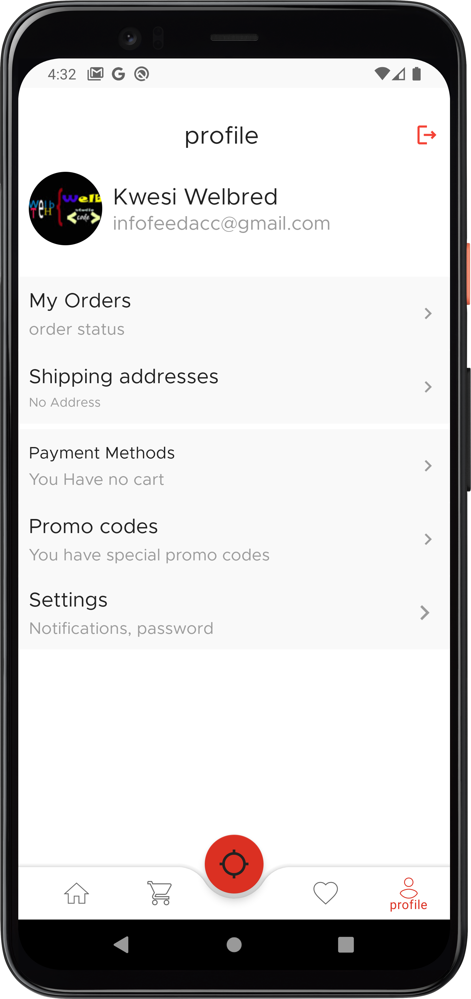
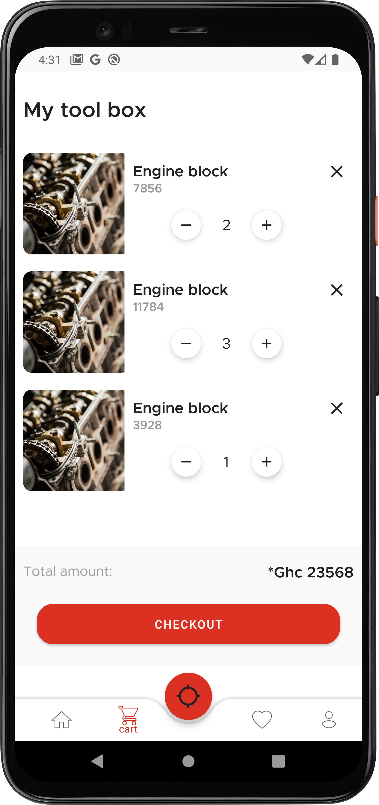
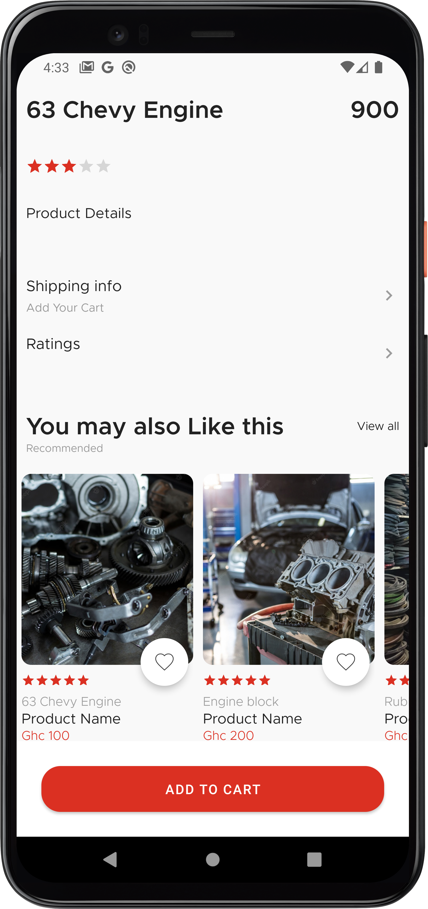
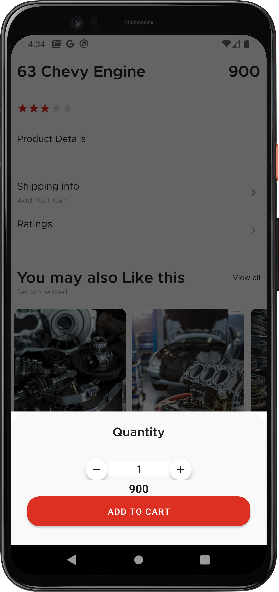

# Online Automobile spare part delivery system
Munchy, an online food delivery system written in kotlin, java, postgres and ktor as the backend where users can order food and place order.

## Overview
The application contains list of auto mobile spare which user can click to view its details and then, add them to cart. User can like and dislike the spare. 
Also, User can search for a nearest fitting shop using google map.
Some other features are as following:
- Authentication process such as </b> Login, Sign up and reset password process
- Recyclerview with variable span size to show products.
- Search Bar and filtering
- Add cart
- Increase/Decrease quantity of product in the cart.
- Place Order.
- Payment system
- Modify status of order.
- Add/Edit Address
- Tested using Espresso. Written unit, instrumentation and UI tests.

## Automobile Application screenshots
|                                           authentication mobile navigation                                |
| :-------------------------------------------------------------------------------------------------------: |
|                                                                     |

## authentication screens
|                 Signup              |           Forgot password          |             Login            |
| :---------------------------------: | :--------------------------------: | :---------------------------:|
|    |  |    |

## Password reset process

|           Email verification            |             Open email link            |             OTP                    |               Password reset        |         Reset all done          |
| :-------------------------------------: | :------------------------------------: | :---------------------------------:| :---------------------------------: | :----------------------------:  |
|  |         |  |  |  |

## Home 
|                 Home                |           Home                     |             Map              |
| :---------------------------------: | :--------------------------------: | :---------------------------:|
|    |  |    |

|                 Profile                |           Favorite              |             Cart              |
| :---------------------------------: | :--------------------------------: | :---------------------------:|
|    |  |    |

|                 Detail              |           Detail              |             Add to cart           |
| :---------------------------------: | :--------------------------------: | :---------------------------:|
|    |  |    |

## Stack
- Kotlin
- Java
- Kotlin coroutines
- Room
- Datastore
- Firebase
- Material component
- Glide
